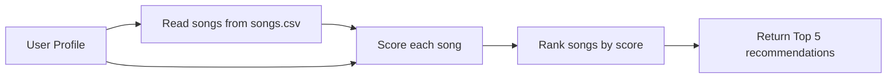

# 🎵 Music Recommender Simulation

## Project Summary

In this project you will build and explain a small music recommender system.

Your goal is to:

- Represent songs and a user "taste profile" as data
- Design a scoring rule that turns that data into recommendations
- Evaluate what your system gets right and wrong
- Reflect on how this mirrors real world AI recommenders

This project builds a small content-based music recommender that suggests songs based on a user’s taste profile. The system compares song attributes like genre, mood, energy, and acousticness to what the user prefers, then assigns each song a score. After scoring all songs, it ranks them from highest to lowest and returns the top recommendations. The goal is to show how recommendation systems can turn user preferences and item features into predictions in a simple and explainable way.

---

## How The System Works

This recommender uses a content-based approach, meaning it recommends songs by comparing a user’s preferences directly to the features of each song in the catalog. Instead of learning from many users’ listening behavior, this version focuses on matching song attributes like genre, mood, energy, and acousticness. The goal is to build a simple and explainable system that shows how recommendation logic can be turned into code.

Each `Song` in the dataset includes attributes such as `genre`, `mood`, `energy`, `tempo_bpm`, `valence`, `danceability`, and `acousticness`. For scoring, my system mainly uses `genre`, `mood`, `energy`, and `acousticness`. The `UserProfile` stores a favorite genre, a favorite mood, a target energy level, and whether the user prefers acoustic songs. This gives the recommender enough information to tell apart different types of listeners, such as someone who likes chill lofi versus someone who prefers intense rock.

### Features Used

**Song**
- genre
- mood
- energy
- acousticness

**UserProfile**
- favorite_genre
- favorite_mood
- target_energy
- likes_acoustic

### Example User Profile

```python
{
    "favorite_genre": "lofi",
    "favorite_mood": "chill",
    "target_energy": 0.4,
    "likes_acoustic": True
}
```

### Algorithm Recipe

My recommender uses a weighted scoring system to decide which songs to recommend.

For each song:
- add **+2.0 points** if the song’s genre matches the user’s favorite genre
- add **+1.5 points** if the song’s mood matches the user’s favorite mood
- add up to **+2.0 points** based on how close the song’s energy is to the user’s target energy
- add up to **+1.0 point** based on whether the song matches the user’s acoustic preference

After scoring every song in the dataset, the system sorts the songs from highest score to lowest score and returns the top 5 recommendations.

### Data Flow

Input: User preferences  
Process: Loop through every song in `songs.csv`, compute a score using the scoring logic, and save the result  
Output: Rank all songs by score and return the top recommendations


    
---

## Getting Started

### Setup

1. Create a virtual environment (optional but recommended):

   ```bash
   python -m venv .venv
   source .venv/bin/activate      # Mac or Linux
   .venv\Scripts\activate         # Windows

2. Install dependencies

```bash
pip install -r requirements.txt
```

3. Run the app:

```bash
python -m src.main
```

### Running Tests

Run the starter tests with:

```bash
pytest
```

You can add more tests in `tests/test_recommender.py`.

---

## Experiments You Tried

I experimented with changing the weights used in the scoring system to see how the recommendations shifted. When genre was weighted more heavily, the recommender became stricter and mostly returned songs from the exact preferred genre, even if other songs matched the user’s mood and energy well. When mood or energy mattered more, the system produced recommendations that felt more flexible and vibe-based instead of being tied mainly to genre labels.

I also thought about adding features such as tempo and valence to make the scoring more detailed. This could help the system better distinguish between songs that share the same genre but feel very different. At the same time, adding too many features could make the scoring harder to explain and easier to overfit to small differences in the dataset.

---

## Limitations and Risks

This recommender only works on a very small catalog, so the recommendations are limited by what is available in the dataset. It does not understand lyrics, artist similarity, language, cultural context, or listening history, which means it misses many factors that shape real music preferences. It may also over-favor certain genres or moods depending on how the scoring weights are chosen. Because the rules are hand-designed, the system reflects human assumptions and may not generalize well to every listener.

---

## Reflection

Read and complete `model_card.md`:

[**Model Card**](model_card.md)

Write 1 to 2 paragraphs here about what you learned:

- about how recommenders turn data into predictions
- about where bias or unfairness could show up in systems like this


---

## 7. `model_card_template.md`

Combines reflection and model card framing from the Module 3 guidance. :contentReference[oaicite:2]{index=2}  

```markdown
# 🎧 Model Card - Music Recommender Simulation

## 1. Model Name

Give your recommender a name, for example:

> VibeFinder 1.0

---

## 2. Intended Use

- What is this system trying to do
- Who is it for

Example:

> This model suggests 3 to 5 songs from a small catalog based on a user's preferred genre, mood, and energy level. It is for classroom exploration only, not for real users.

---

## 3. How It Works (Short Explanation)

Describe your scoring logic in plain language.

- What features of each song does it consider
- What information about the user does it use
- How does it turn those into a number

Try to avoid code in this section, treat it like an explanation to a non programmer.

---

## 4. Data

Describe your dataset.

- How many songs are in `data/songs.csv`
- Did you add or remove any songs
- What kinds of genres or moods are represented
- Whose taste does this data mostly reflect

---

## 5. Strengths

Where does your recommender work well

You can think about:
- Situations where the top results "felt right"
- Particular user profiles it served well
- Simplicity or transparency benefits

---

## 6. Limitations and Bias

Where does your recommender struggle

Some prompts:
- Does it ignore some genres or moods
- Does it treat all users as if they have the same taste shape
- Is it biased toward high energy or one genre by default
- How could this be unfair if used in a real product

---

## 7. Evaluation

How did you check your system

Examples:
- You tried multiple user profiles and wrote down whether the results matched your expectations
- You compared your simulation to what a real app like Spotify or YouTube tends to recommend
- You wrote tests for your scoring logic

You do not need a numeric metric, but if you used one, explain what it measures.

---

## 8. Future Work

If you had more time, how would you improve this recommender

Examples:

- Add support for multiple users and "group vibe" recommendations
- Balance diversity of songs instead of always picking the closest match
- Use more features, like tempo ranges or lyric themes

---

## 9. Personal Reflection

A few sentences about what you learned:

- What surprised you about how your system behaved
- How did building this change how you think about real music recommenders
- Where do you think human judgment still matters, even if the model seems "smart"

---
## Instruction Summary


